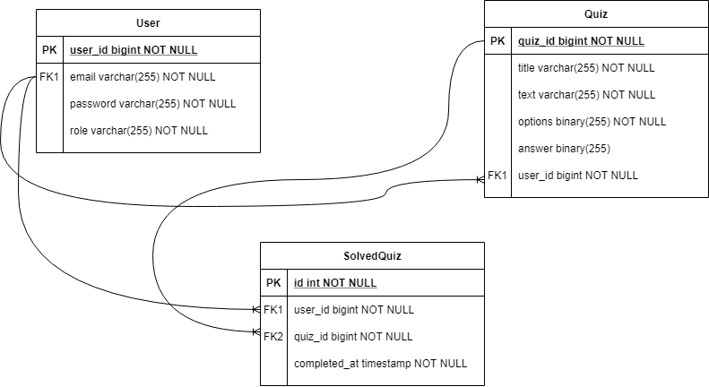

# Quiz engine REST API
This is a simple Spring REST service for solving quizzes. The service allows you to receive and solve quizzes, as well as create, modify and delete your own quizzes. The service provides user registration. Authentication is via HTTP Basic auth. The embedded H2 is used as the data storage.
## Getting Started
In application.properties you can specify the name of the database and username and password to access the database.

The service provides a built-in user with the username "admin". The application reads the password from the environment variable "ADMIN_PASS". To set the password, you must set an environment variable with this name, otherwise the password "password" will be used.
#### Run the app

    gradle bootRun

# Endpoints

## 1. Register

Registers a new user.

#### Request

```
POST /api/register
```
#### Request body

User entity.

#### Response
* **Success Response:**
200 Ok - if the user is successfully registered
* **Error Response:**
404 Bad request - if the provided email is already taken

## 2. Get all quizzes

Provides a list of all quizzes in the Page object wrapper.

#### Request

```
GET /api/quizzes?page=?
```
#### Request parameters

page (int) - page number for the quiz list.

#### Response
* **Success Response:**
200 Ok
Response body - Page<Quiz>
* **Error Response:**
401 Unauthorized - if a user with these credentials is not registered.

## 3. Get quiz by id

Provides a quiz with this id.

#### Request

```
GET /api/quizzes/{id}
```
#### Path varables

id (int) - id of the quiz.

#### Response
* **Success Response:**
200 Ok
Response body - Quiz
* **Error Response:**
401 Unauthorized - if a user with these credentials is not registered.
404 Bad request - if quiz with this id does not exist.

## 4. Get solved quizzes

Provides all solved quizzes by this user in the Page object wrapper.

#### Request

```
GET /api/quizzes/completed
```
#### Request parameters

page (int) - page number for the solved quiz list.

#### Response
* **Success Response:**
200 Ok
Response body - Page<SolvedQuiz>
* **Error Response:**
401 Unauthorized - if a user with these credentials is not registered.

## 5. Create quiz

Creates a new quiz.

#### Request
```
POST /api/quizzes
```
#### Request body

Quiz - a quiz to save.

#### Response
* **Success Response:**
200 Ok
Response body - Quiz (saved quiz)
* **Error Response:**
401 Unauthorized - if a user with these credentials is not registered.

## 6. Solve quiz

Solving a quiz with the given id.

#### Request
```
POST /api/quizzes/{id}/solve
```
#### Path varables

id (int) - id of the quiz.

#### Request body

UserAnswer - answer on this quiz.

#### Response
* **Success Response:**
200 Ok
Response body - ResponseAnswer
* **Error Response:**
401 Unauthorized - if a user with these credentials is not registered.
404 Bad request - if quiz with this id does not exist.

## 7. Update quiz

Update a quiz with the given id.

#### Request
```
PUT /api/quizzes/{id}
```
#### Path varables

id (int) - id of the quiz.

#### Request body

Quiz - updated quiz.

#### Response
* **Success Response:**
200 Ok
Response body - Quiz (updated quiz)
* **Error Response:**
401 Unauthorized - if a user with these credentials is not registered.
403 Forbidden - if this quiz does not belong to the user.
404 Bad request - if quiz with this id does not exist.

## 8. Delete quiz

Delete a quiz with given id.

#### Request
```
DELETE /api/quizzes/{id}
```
#### Path varables

id (int) - id of the quiz.

#### Response
* **Success Response:**
204 No content
* **Error Response:**
401 Unauthorized - if a user with these credentials is not registered.
403 Forbidden - if this quiz does not belong to the user.
404 Bad request - if quiz with this id does not exist.

# JSON Entities
## 1. Quiz
Represents a quiz to send and receive from the API.
#### JSON representation
Here is a JSON representation of `Quiz`.
```json
{
"title": "Math",
"text": "Which of the following is equal to 4?",
"options": ["1+3","2+2","8-1"],
"answer" : [0,1]
}
```
### Properties
| Property | Constraint | Description |
|:---------|:-----|:------------|
| **title**   | not null | Quiz name |
| **text** | not null | Quiz description |
| **options** | not null | Answer options |
| **answer** | nullable | Correct answers |

## 2. ResponseAnswer
Used to respond to a user's answer to a quiz.
#### JSON representation
Here is a JSON representation of `ResponseAnswer`.
```json
{
"success": "true",
"feedback": "Congratulations, you're right!"
}
```
### Properties
| Property | Constraint | Description |
|:---------|:-----|:------------|
| **success**   | not null | Boolean |
| **feedback** | not null | Feedback about user answer |

## 3. User
Used to register a user in the service.
#### JSON representation
Here is a JSON representation of `User`.
```json
{
"email": "myEmail@gmail.com",
"password": "password"
}
```
### Properties
| Property | Constraint | Description |
|:---------|:-----|:------------|
| **email**   | email regex | Users email |
| **password** | size >= 5 | Users password |

## 4. UserAnswer
used to solve the quiz by the user.
#### JSON representation
Here is a JSON representation of `UserAnswer`.
```json
{
"answer": [0,1]
}
```
### Properties
| Property | Constraint | Description |
|:---------|:-----|:------------|
| **answer**   | nullable | int array |
# Database schema
